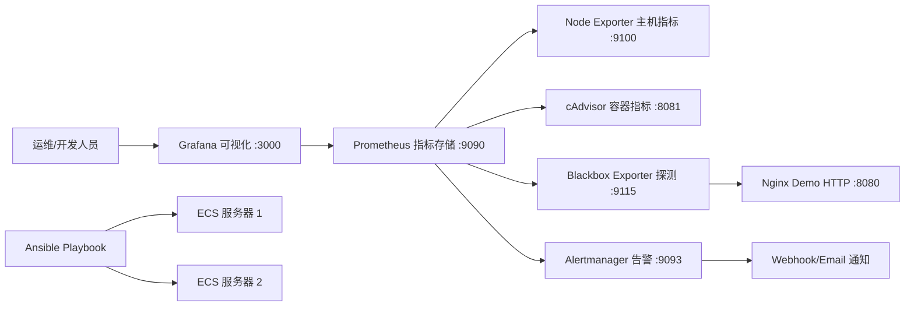

# 基于 Prometheus + Grafana + Alertmanager 的云服务器监控与告警自动化平台

面向阿里云 ECS 和常见 Linux 服务器运维场景，本项目实现了一套容器化、可视化、可批量部署的云原生监控告警平台。系统使用 Prometheus 采集主机、Docker 容器和 HTTP 服务可用性指标，使用 Grafana 自动导入 Dashboard 展示核心指标，使用 Alertmanager 完成告警分组、抑制和通知，并通过 Ansible Playbook 支持多台服务器一键部署。

## 项目架构



## 技术栈

- Prometheus: 指标采集、存储、PromQL 查询和告警规则计算。
- Grafana: 自动配置 Prometheus 数据源并导入主机、容器、服务可用性 Dashboard。
- Alertmanager: 告警分组、抑制、重复通知控制、恢复通知。
- Node Exporter: Linux 主机 CPU、内存、磁盘、网络、负载等指标。
- cAdvisor: Docker 容器 CPU、内存、网络和生命周期指标。
- Blackbox Exporter: HTTP/TCP 服务可用性探测。
- Docker Compose: 一键启动、停止、重启整套监控平台。
- Ansible: 多台服务器批量安装 Docker、分发配置并启动服务。
- Shell: 本地部署、检查、备份、清理和混沌测试脚本。

## 目录结构

```text
monitoring-platform/
├── docker-compose.yml
├── .env.example
├── README.md
├── prometheus/
│   ├── prometheus.yml
│   └── rules/
├── alertmanager/
├── grafana/
│   ├── provisioning/
│   └── dashboards/
├── blackbox/
├── ansible/
├── scripts/
│   └── chaos/
└── docs/
```

## 快速启动

在 Linux 云服务器上执行：

```bash
cd monitoring-platform
cp .env.example .env
```

修改 `.env` 中的 Grafana 密码：

```bash
GF_SECURITY_ADMIN_PASSWORD=YOUR_PASSWORD
SERVER_IP=YOUR_SERVER_IP
```

启动：

```bash
docker compose up -d
docker compose ps
```

如果在阿里云 ECS 上出现 `registry-1.docker.io:443 connection refused`，先配置 Docker 镜像加速：

```bash
ACR_MIRROR=https://YOUR_ACR_ACCELERATOR_ID.mirror.aliyuncs.com sudo -E scripts/configure_docker_mirror.sh
docker compose pull
```

`YOUR_ACR_ACCELERATOR_ID` 在阿里云容器镜像服务 ACR 的“镜像工具 -> 镜像加速器”页面获取。项目默认使用 `ghcr.io/google/cadvisor:0.55.1`，比旧的 `gcr.io` 来源更适合当前部署环境；如果 GHCR 仍拉取失败，请把该镜像同步到自己的 ACR 仓库，然后在 `.env` 中设置 `CADVISOR_IMAGE=registry.cn-hangzhou.aliyuncs.com/YOUR_NAMESPACE/cadvisor:0.55.1`。

也可以使用项目脚本：

```bash
chmod +x scripts/*.sh scripts/chaos/*.sh
scripts/deploy.sh
scripts/status.sh
```

访问地址：

- Prometheus: `http://服务器IP:9090`
- Grafana: `http://服务器IP:3000`
- Alertmanager: `http://服务器IP:9093`
- Demo HTTP: `http://服务器IP:8080`

Grafana 默认账号密码来自 `.env`，首次演示可使用 `admin / YOUR_PASSWORD`。

## Docker Compose 部署说明

核心服务在 `docker-compose.yml` 中定义：

- `prometheus`: 加载 `prometheus/prometheus.yml` 和 `prometheus/rules/*.yml`。
- `grafana`: 自动加载 `grafana/provisioning` 和 `grafana/dashboards`。
- `alertmanager`: 加载 `alertmanager/alertmanager.yml`。
- `node-exporter`: 采集宿主机 Linux 指标。
- `cadvisor`: 采集 Docker 容器指标。
- `blackbox-exporter`: 探测 HTTP 服务可用性。
- `nginx-demo`: 用于演示 HTTP 可用性监控和故障模拟。

常用命令：

```bash
scripts/deploy.sh
scripts/status.sh
scripts/restart.sh
scripts/stop.sh
scripts/check.sh
scripts/backup.sh
scripts/reset_grafana_password.sh 'NEW_PASSWORD'
```

阿里云 CI/CD 持续集成部署方案见 `docs/ci-cd.md`，支持云效 Flow，也支持 GitHub Actions 通过 SSH 部署到 ECS。仓库已提供 `.github/workflows/deploy-to-ecs.yml` 示例。

国内 ECS 拉取镜像失败时：

```bash
ACR_MIRROR=https://YOUR_ACR_ACCELERATOR_ID.mirror.aliyuncs.com sudo -E scripts/configure_docker_mirror.sh
docker compose pull
docker compose up -d
```

## Ansible 多服务器部署

编辑 `ansible/inventory.ini`：

```ini
[monitoring_servers]
YOUR_SERVER_IP ansible_user=root
```

编辑 `ansible/group_vars/all.yml`，设置安装目录、Grafana 密码、时区等变量。

执行部署：

```bash
cd monitoring-platform
ansible-playbook -i ansible/inventory.ini ansible/playbook.yml
```

Playbook 会完成：

- 批量安装 Docker 和 Docker Compose 插件。
- 创建 `/opt/monitoring-platform` 项目目录。
- 分发 Compose 文件、Prometheus、Grafana、Alertmanager、Blackbox 配置。
- 生成远端 `.env`。
- 启动监控系统并输出容器状态。

说明：Ubuntu/Debian 使用 `docker.io` 和 `docker-compose-plugin` 包；CentOS/Alibaba Cloud Linux 使用 `docker` 和 `docker-compose-plugin` 包。如果镜像源没有 Compose 插件，请先启用 Docker 官方仓库或云厂商 Docker CE 源。

## Prometheus 配置说明

`prometheus/prometheus.yml` 设置：

- `scrape_interval: 15s`
- `evaluation_interval: 15s`
- 采集 Prometheus 自身、Alertmanager、Node Exporter、cAdvisor。
- 通过 Blackbox Exporter 探测 `http://nginx-demo:80`。
- 加载 `/etc/prometheus/rules/*.yml` 下所有告警规则。

如果要让中心 Prometheus 监控多台 ECS，可在 `node-exporter` job 中加入：

```yaml
- targets:
    - 10.0.0.11:9100
    - 10.0.0.12:9100
```

## Grafana Dashboard

启动后 Grafana 会自动配置 Prometheus 数据源，并在 `Cloud Native Monitoring` 文件夹下导入：

- `Linux 主机监控`: CPU、内存、磁盘、网络、系统负载、磁盘 IO。
- `Docker 容器监控`: 容器数量、CPU、内存、网络、最后观测时间。
- `服务可用性监控`: HTTP 探测状态、响应耗时、HTTP 状态码。

Dashboard JSON 位于 `grafana/dashboards/`，可直接导入其他 Grafana 环境。

## Alertmanager 告警说明

Prometheus 告警规则位于：

- `prometheus/rules/host_alerts.yml`
- `prometheus/rules/container_alerts.yml`
- `prometheus/rules/service_alerts.yml`

已实现告警：

- 服务器宕机: `up{job="node-exporter"} == 0`
- CPU 使用率超过 80%
- 内存使用率超过 80%
- 磁盘使用率超过 85%
- 磁盘 IO 等待过高
- 系统负载过高
- 容器重启或指标消失
- HTTP 服务不可访问: `probe_success == 0`

Alertmanager 配置位于 `alertmanager/alertmanager.yml`，包含：

- `group_by`: 按告警名、类型、严重级别分组。
- `group_wait`、`group_interval`、`repeat_interval`: 控制通知节奏。
- `inhibit_rules`: 主机宕机时抑制同实例低级别告警。
- `send_resolved: true`: 发送恢复通知。
- Webhook 和邮件通知示例。

生产使用时，把 webhook URL 替换为你的通知网关，例如钉钉、飞书、企业微信或自建告警适配器。

## 混沌工程测试

脚本位于 `scripts/chaos/`，执行前都会提示确认，且支持恢复：

```bash
scripts/chaos/cpu_stress.sh
scripts/chaos/memory_stress.sh
scripts/chaos/disk_fill.sh
scripts/chaos/stop_container.sh nginx-demo
scripts/chaos/stop_service.sh
scripts/chaos/recover.sh
```

可通过环境变量调整强度：

```bash
DURATION=600 WORKERS=4 scripts/chaos/cpu_stress.sh
MEMORY_MB=1024 scripts/chaos/memory_stress.sh
DISK_MB=2048 scripts/chaos/disk_fill.sh
```

观察路径：

1. Prometheus `Alerts` 页面查看告警从 pending 到 firing。
2. Alertmanager 页面查看告警分组、抑制和恢复。
3. Grafana Dashboard 查看 CPU、内存、磁盘、HTTP 可用性的变化。

## 阿里云安全组端口

在 ECS 安全组入方向开放演示所需端口，来源建议限制为你的办公公网 IP：

- `3000/tcp`: Grafana
- `9090/tcp`: Prometheus
- `9093/tcp`: Alertmanager
- `9100/tcp`: Node Exporter，多机中心采集时需要
- `8080/tcp`: Demo HTTP 服务
- `8081/tcp`: cAdvisor Web 页面，可选
- `9115/tcp`: Blackbox Exporter，可选

生产环境不建议将 Prometheus、Alertmanager、Exporter 端口直接暴露到公网，可通过安全组白名单、VPN、堡垒机或 Nginx 反向代理加认证访问。

## 常见问题排查

- `docker compose up -d` 失败：先执行 `docker compose config -q` 检查 Compose 语法。
- Prometheus Targets DOWN：执行 `docker compose ps` 和 `docker compose logs prometheus`。
- Grafana 看不到 Dashboard：检查 `grafana/provisioning/dashboards/dashboard.yml` 和容器日志。
- Alertmanager 没有通知：确认 Prometheus Alerts 已经 firing，并替换真实 webhook URL。
- cAdvisor 启动失败：确认运行在 Linux 宿主机，并且 Docker 有权限挂载 `/sys`、`/var/lib/docker`。

更多排查见 `docs/troubleshooting.md`。

## 项目验收标准

1. `docker compose up -d` 可以正常启动所有核心容器。
2. Prometheus `Status -> Targets` 页面核心目标全部为 UP。
3. Grafana 可以正常登录并查看 3 个自动导入的 Dashboard。
4. Alertmanager 可以接收到 Prometheus 告警。
5. CPU、内存、磁盘、容器、HTTP 服务异常可以触发告警。
6. Ansible 可以在多台服务器上批量部署。
7. README 和 docs 文档足够支撑课程设计、实习项目或简历项目说明。
8. 敏感配置使用 `.env` 或占位符，不硬编码真实密码。
9. 代码结构清晰，可直接上传 GitHub。

## 如何演示这个项目

1. 展示目录结构，说明 Prometheus、Grafana、Alertmanager、Exporter、Ansible 和 chaos 脚本的位置。
2. 执行 `cp .env.example .env`，修改 Grafana 密码。
3. 执行 `docker compose up -d && docker compose ps`，展示所有容器运行。
4. 打开 Prometheus `Targets` 页面，说明 node-exporter、cAdvisor、blackbox-http 均为 UP。
5. 打开 Grafana，展示 Linux 主机、Docker 容器、服务可用性 3 个 Dashboard。
6. 执行 `scripts/chaos/stop_service.sh` 停止 nginx-demo，等待 1 到 2 分钟。
7. 在 Prometheus `Alerts` 和 Alertmanager 页面展示 `HTTPServiceDown` 告警。
8. 执行 `scripts/chaos/recover.sh`，展示告警恢复。
9. 简要展示 `ansible/playbook.yml` 和 `ansible/roles/monitoring/tasks/main.yml`，说明多服务器批量部署流程。

## 简历项目描述

项目名称：基于 Prometheus + Grafana + Alertmanager 的云服务器监控与告警自动化平台

项目描述：
针对阿里云 ECS 云服务器运维场景，设计并实现一套基于 Prometheus、Grafana、Alertmanager 的标准化监控告警系统，支持主机、容器和服务可用性指标采集、可视化展示、自动告警与批量部署。

项目职责：

- 使用 Docker Compose 容器化部署 Prometheus、Grafana、Alertmanager、Node Exporter、cAdvisor 等组件，实现监控系统一键启停；
- 编写 Prometheus 采集配置与告警规则，实现 CPU、内存、磁盘、容器状态、服务可用性等核心指标监控；
- 配置 Grafana 数据源与 Dashboard 自动导入，实现主机和容器运行状态可视化展示；
- 配置 Alertmanager 告警分组、抑制和通知策略，实现异常状态自动告警；
- 编写 Ansible Playbook，实现多台云服务器批量安装 Docker、分发配置文件并启动监控服务；
- 编写 Shell 混沌测试脚本，模拟 CPU、内存、磁盘、容器异常等故障，验证监控告警链路有效性。

项目成果：

- 实现监控平台容器化部署和自动化运维，部署效率提升约 90%；
- 完成主机、容器、服务可用性多维度监控；
- 通过故障模拟验证告警链路，提升系统可靠性和故障响应能力。

## 后续优化方向

- 增加 Nginx 反向代理与 HTTPS 认证，保护 Grafana/Prometheus/Alertmanager。
- 引入 Loki + Promtail，实现日志采集和指标联动分析。
- 使用 Thanos 或 VictoriaMetrics 扩展长期存储和多集群查询。
- 编写自定义 webhook adapter，对接钉钉、飞书、企业微信。
- 将 Ansible 拆分为中心监控节点和 exporter 节点两类角色。
- 增加 CI 流水线，自动校验 YAML、PromQL、Dashboard JSON 和 Shell 脚本。
