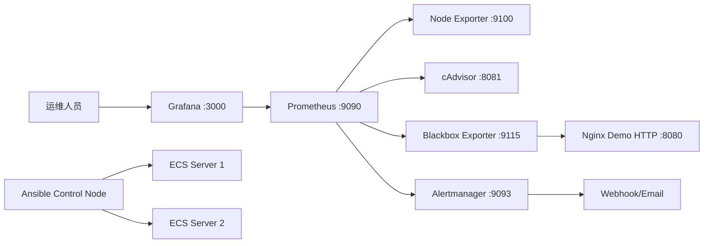

# 架构说明

本项目以 Docker Compose 为本地和单机 ECS 部署入口，使用 Ansible 将同一套工程批量分发到多台服务器。

默认模式是在每台 ECS 上部署一套完整监控栈，适合课程设计、简历演示和小规模服务器管理。生产环境中也可以只保留一个中心 Prometheus/Grafana/Alertmanager，然后在其他机器上部署 node-exporter/cAdvisor，并把目标加入 `prometheus/prometheus.yml`。

